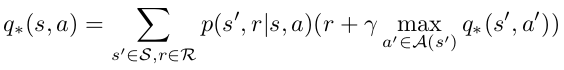
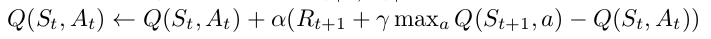
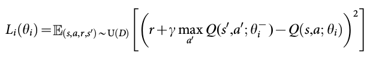
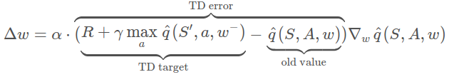
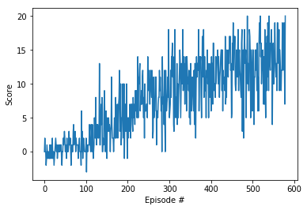

# 1. Introduction
This document describes the training of a yellow banana collecting robot that is operating in a (bounded) world where yellow and blue bananas are spawned randomly. For each collected yellow banana the robot receives a reward of +1; each blue banana gives a reward of -1. The training task is episodic - this means that the environment is reset after the robot has performed 1000 consecutive actions.
The robot can select from 4 actions (move forward, move backwards, turn left, turn right) and observes a total of states (robot velocity and ray based measurement of objects in the forward field of view).

The training task is considered solved when the robot is able to achieve an average score of +13 for 100 consecutive episodes. The project contains the following files with the following functions:

- Navigation.ipynb: Jupyter Notebook to load the required python modules, perform the training process and display the results
- dqn_agent.py: contains the classes Agent and ReplayBuffer. In the ReplayBuffer (state, action, reward, next_state)-tuples are recorded during robot operation and are stored to be used in the training process.
  The Agent class defines (among others) the functions to select the next action for the robot and to learn the Q-table that is required in the process of finding the best robot action. It is explained in greater detail in the next section of this document.
- model.py: here the architecture of the neural networks that are used to predict the Q-values for the state-action combinations are defined
- checkpoint.pth: Snapshot of a trained network that can be used to select the next action for a given state value.

# 2. Learning Algorithm
In this section the Learning Algorithm that is defined in dqn_agent.py is described in greater detail. The goal of Deep-Q-Learning is to learn a so called Q-Table which gives the expected future (discounted) reward for each state-action pair that can be reached. The formula how to compute the so called Q-value for a distinct state-action pair is shown in the following [1]:

As can be seen from the formula the Q-value for a state-action pair (s,a) can be computed recursively as the immediate reward r added to the discounted future reward when following the optimal policy from state s' (which is reached by performing action a in state s). To account for the stochasticity of the process a weighted sum over all states that can be reached by performing action a in state s is computed; the weighting is performed according to the possibility to reach state s' by performing action a. The discount factor gamma (<1) is used to motivate the agent to accumulate reward as quickly as possible.

If this process is performed for all possible state action combinations the already mentioned Q-table can be computed and can be used to pick the optimal action from a certain state by selecting the action with the highest Q-value.

The Q-table is not known at the beginning of the training process but instead has to be learned over the training process. There exist a variety of training algorithms to do so - one that is well known is called SARSAmax. Here the Q-table is updated while the robot is operating/exploring its environment. The robot actions are chosen with a so called eps-greedy strategy. This means that mostly the action is selected which is currently assumed to be optimal - but not always. In a small percentage of cases another action is selected randomly from the robot action space. This is done so that the robot explores its whole action space properly. The update formula for the Q-table can be seen in the following [2]:

As can be seen from the formula in the case of the SARSAmax algorithm the current estimate for the future discounted reward Q(s,a) is updated with the difference between the current estimate and an updated estimate which is created by adding the observed reward R(t+1) to the discounted future reward when choosing the action that provides the maximum Q-value from state S(t+1). This is also called the target value. The difference is multiplied with a (small) factor alpha which can be seen as a learning rate in this context.

So far it was assumed that the presented SARSAmax algorithm operates on discrete state and action spaces. If the state space is continuous instead a discretization method could be used. Another way is to use a neural network that acts as a function approximator, takes the current state as input and computes the expected Q-value for each action from this state. If the SARSAmax formula is to be used with neural networks a loss has to be defined that can be used to train the network via backpropagation:

As before the difference between the current Q-value Q(s,a,theta) and the updated Q-value (r+gamma(max(Q(s',a',theta-)))) is computed. The loss is then the square of this difference and the update rule for the network weights is as follows:

Please note that for the computation of the updated Q-value a network with "frozen" weights (theta-) is used. This is done because a simultaneous update of the current and the target Q-value can lead to unpredictable behaviour. Instead the weights that are used to compute the target values are kept constant over a certain amount of training steps and are only then updated with the newly learned weights.
In the next section the architecture of the used network is explained.

# 3. Network Architecture
In correspondence to the state and output spaces the network has 37 inputs and 4 outputs. In between there are 2 fully connected layers - each with 64 neurons. Relu-functions are used at the output of each of the two fully connected layers.

# 4. Training Progress
To train the network a pool of training samples is built that consists of (state, action, reward, next_state, done)-tuples that are recorded during the training process. To avoid correlations between training samples, batches are sampled randomly from this training pool and are provided to the network.
The following hyperparameters are chosen for the training process:

- To implement the epsilon greedy exploration strategy an initial eps-parameter of 1 is selected. This gives a random exploration strategy at the start of the training process. This value is then multiplied with 0.995 after each episode and bounded from below at 0.01. This means that as the training proceeds the tendency goes towards chosing the action which is assumed to be optimal.
- The discount factor gamma is set to 0.99
- The learning rate for the network is 5e-4
- The parameters of the target network are updated every 4 episodes; the update is performed as a "soft update" where the old network parameters are weighted with 1e-3 and the new parameters are weighted with 0.999.

The training progress can be seen in the following figure:

Ultimately it took 479 episodes to train the network.

# 5. Ideas for Future Work
To enhance the training process it could be interesting to prefer training tuples that produce a significant training error. This strategy is known as Prioritized Experience Replay.

Another option is to use two sets of weights for the computation of the target value - one is used for the selection of the optimal action and the other is used to compute the expected Q-value with this action. For the computation of the expected Q-value the frozen weights theta- can be used. The goal of this strategy is to reduce the overestimation tendency of the target network in the case of random estimation errors [5] (which could e.g. be caused by the randomly initialized weights in the early stages of the network training process). This method is known as Double DQN.

# 6. References
[1], [2]: Reinforcement Learning Cheat Sheet (downloaded from https://github.com/udacity/deep-reinforcement-learning/blob/master/cheatsheet/cheatsheet.pdf)

[3]: Mnih V., et al: Human-level control through deep reinforcement learning; NATURE, vol. 508, p.529-533, 2015

[4]: downloaded from https://classroom.udacity.com/nanodegrees/nd893/parts/6b0c03a7-6667-4fcf-a9ed-dd41a2f76485/modules/4eeb16ab-5ac5-47bf-974d-12784e9730d7/lessons/a6829f14-5ef0-4b4a-83ed-234029c5cc60/concepts/22d7ab96-d6d2-4605-8cb6-2a8b5bd087f2

[5] v. Hasselt H., Guez A., Silver D.: Deep Reinforcement Learning with Double Q-Learning; arXiv:1509.06461v3 [cs.LG]; 8 Dec 2015